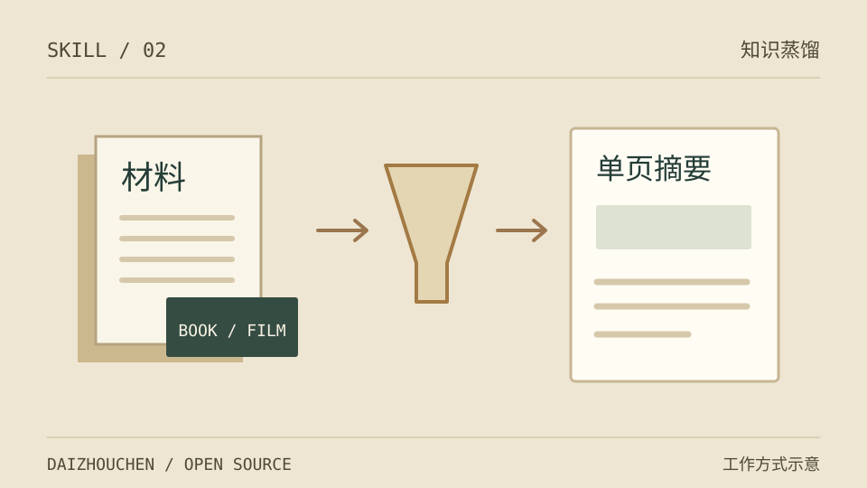

# Book Distiller · 读书蒸馏



同系列：[书籍蒸馏](https://github.com/daizhouchen/book-distiller) · [电影蒸馏](https://github.com/daizhouchen/movie-distiller) · [领域入门](https://github.com/daizhouchen/domain-onboarding)

把一本书的事实、结构和观点整理成中文阅读网页，保留原文锚点、外部解读和来源分级。适合需要系统读书笔记或深度解读的任务。

这是由 AI 助手执行的 Skill；脚本负责检索计划、渲染和结构检查，不会独立读完一本书。

## 能做什么

- 按人物、叙事、论证、模型等七种“基因”组织书的骨架。
- 沿“事实 → 机制 → 观点”展开，区分原文、评论与未核证信息。
- 输出 `distill.json` 和 HTML，提供速读、精读、深读三种阅读模式；模板无需 CDN。
- 深度工作流与适用字段见 [SKILL.md](SKILL.md)；资料不足时明确缩小覆盖范围。

## 安装

需要支持本地 Skills 的 AI 助手、Git 和 Python 3.7+。本仓库 Python 脚本仅使用标准库；检索资料需要助手的联网工具。

Claude Code 个人安装（macOS / Linux）：

```bash
mkdir -p ~/.claude/skills
git clone https://github.com/daizhouchen/book-distiller.git ~/.claude/skills/book-distiller
```

Windows PowerShell：

```powershell
git clone https://github.com/daizhouchen/book-distiller.git "$env:USERPROFILE/.claude/skills/book-distiller"
```

保留整个目录中的 `SKILL.md`、`references/`、`scripts/` 和 `assets/`，不要只复制入口文件。项目级安装可放在 `.claude/skills/book-distiller/`。

## 使用

在助手中说：“用 book-distiller 蒸馏《书名》，原文在 `/path/to/book.txt`。”没有原文时，会尝试公开资料并标出证据缺口；不会把梗概或模型记忆当原文引用。

默认输出到工作目录下 `book-distiller-workspace/<book-slug>/`；也可指定位置。

在仓库目录中可手动运行：

```bash
# 只生成检索 URL 和候选分级，不执行 HTTP 抓取
python scripts/fetch_sources.py "书名" "作者"
# distill.json 由助手根据实际取得的资料生成
python scripts/quality_check.py /path/to/distill.json
python scripts/render.py /path/to/distill.json /path/to/book.html
python scripts/visual_check.py /path/to/book.html
```

检查器覆盖结构、文字密度、引用数量和页面标记，不验证引文真伪，也不能替代浏览器中的阅读检查。旧数据可使用脚本的 `--legacy` 选项；深度规范详见 [加深协议](references/deepening-protocol.md)。

## 参考与边界

- [七基因与骨架](references/genes.md) · [事实系统化](references/fact-systematization.md) · [来源分级](references/source-triangulation.md)
- [写作方法](references/frameworks-internalization.md) · [视觉规范](references/style-guide.md) · [评估任务](evals/evals.json)
- 缺少可核查原文时，只能交付有明确范围的二手资料解读；不能为满足数量阈值编造章节、引文或页码。
- 默认中文输出。渲染器不负责 PDF/EPUB 提取，电子书可读性取决于助手的文档工具。

MIT License，见 [LICENSE](LICENSE)。

---
<!-- daizhouchen-footer-begin -->

Part of [**daizhouchen 实验集**](https://github.com/daizhouchen) → 一个 AI 应用创造者的实验现场。
<!-- daizhouchen-footer-end -->
